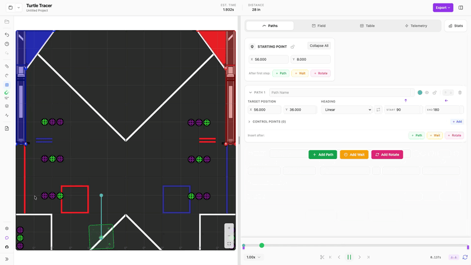
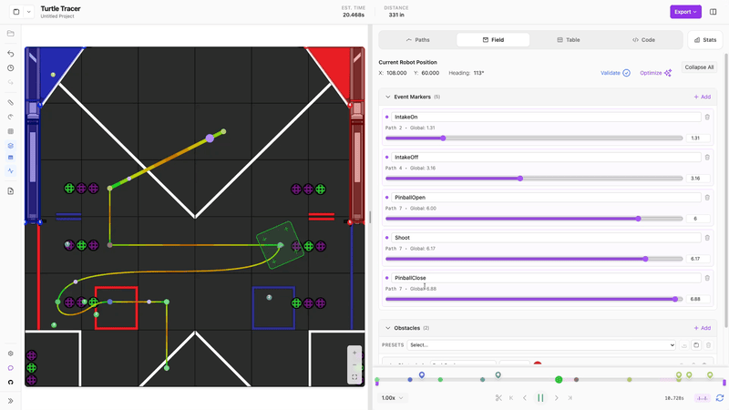
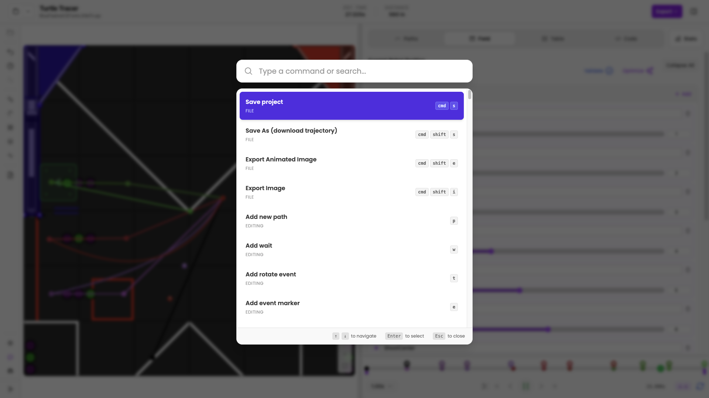
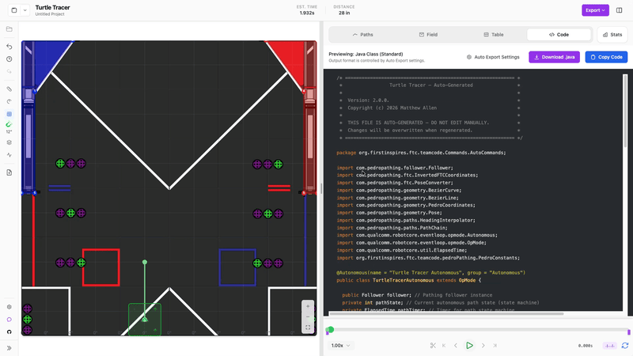

<div align="center">
  
  
  <h1>Turtle Tracer</h1>
  
  <p>
    <b>A path planner for FIRST Tech Challenge, in your browser or on your desktop.</b>
  </p>
  
  <p>
    Visualize • Plan • Simulate • Export
  </p>

  <p>
    <a href="https://live.turtletracer.com/">Open in your browser</a> ·
    <a href="https://www.turtletracer.com/">Documentation</a> ·
    <a href="https://discord.gg/chHSzS4ewF">Discord</a>
  </p>

  <p>
    <a href="https://github.com/Mallen220/TurtleTracer/releases">
      
    </a>
    <a href="https://github.com/Mallen220/TurtleTracer/releases">
      
    </a>
    <a href="LICENSE">
      
    </a>
    
  </p>

<p>
    
    
    
    
    
    
</p>
<p>

  
  <!-- COVERAGE_BADGE_START -->
  <a href="coverage/index.html">
    
  </a>
  <!-- COVERAGE_BADGE_END -->
</p>
  <!-- LIGHTHOUSE_BADGES_START -->
  <p>
    <a href="https://github.com/GoogleChrome/lighthouse">
      
    </a>
    <a href="https://github.com/GoogleChrome/lighthouse">
      
    </a>
    <a href="https://github.com/GoogleChrome/lighthouse">
      
    </a>
    <a href="https://github.com/GoogleChrome/lighthouse">
      
    </a>
  </p>
  <p><sub>Lighthouse badges generated for v2.3.0</sub></p>
  <!-- LIGHTHOUSE_BADGES_END -->

  <a href="https://apps.microsoft.com/detail/9nk0b4fdj3zw?referrer=appbadge&mode=full" target="_blank" rel="noopener noreferrer">
    
  </a>
</div>

<br/>

> **Rapid development notice**
> This project is updated often. Check back for bug fixes and new features, and see the [changelog](CHANGELOG.md) for what changed. If you find an error, report it on the [Issues tab](https://github.com/Mallen220/TurtleTracer/issues) and revert to a previous version.

---

<div align="center">
  
</div>

---

## Table of contents

- [Overview](#overview)
- [Features](#features)
- [Installation](#installation)
- [Workflow and file management](#workflow-and-file-management)
- [Exporting your paths](#exporting-your-paths)
- [Tech stack](#tech-stack)
- [Troubleshooting](#troubleshooting)
- [Contributing](#contributing)
- [License and acknowledgments](#license)

## Overview

Turtle Tracer is a path planner for FIRST Tech Challenge autonomous routines. You draw a path on the field, simulate how your robot would drive it, and export the result as code for your robot.

It is one app with two ways to run it. Use it in your browser at [live.turtletracer.com](https://live.turtletracer.com/), or install the desktop version, which is built with Electron and Svelte. The desktop version also works offline, reads and writes project files on your disk, and shows Git status for your paths.

## Features

### Planning

- Field editor: drag points and control points on the field, draw a rough path with the pencil tool, split or reverse a path, and chain paths so the robot drives them without stopping.
- Headings: set each path's heading to constant, linear, tangential, or facing a point. Piecewise headings change partway along a path, and a chain can share one heading.
- Sequence steps: add waits and turns between paths. Steps with the same name are linked: paths share a position, waits share a duration, and turns share a heading.
- Event markers: attach named events to paths, waits, and turns, and drag them along the timeline.
- Obstacles and keep-in zones: draw the shapes your robot should avoid or stay inside.
- File macros: drag a `.turt` or legacy `.pp` file into another project to reuse it as a sub-routine. Macros can be moved, rotated, and flipped, and Turtle Tracer stops you from making one include itself.
- Path optimizer: tune control points for speed while avoiding obstacles. You can optimize the whole routine or only the paths you pick.
- Mirror and reverse: duplicate a routine mirrored or reversed from the file manager.

  

### Simulation and analysis

- Motion simulation: timing follows your robot's velocity, acceleration, and turn-rate limits.
- Timeline: scrub through the routine with a ghost robot preview, change the playback speed, and loop a section.
- Validation: flags collisions and paths that leave the field. You can turn on continuous checking.
- Path statistics: graphs of velocity, angular velocity, acceleration, and centripetal force, timing for each segment, and warnings such as possible wheel slip.
- Velocity heatmap and tooltips: see how fast the robot is going at any point on the path.
- Telemetry: import robot telemetry and compare what happened on the field with the plan.
- Onion skin: show the robot's outline at intervals along the path.

### Files and workflow

- History: Auto-Save, undo and redo, and a History Panel.
- File manager: folders, recent files, drag and drop, and rename and duplicate. It works in the browser too.
- Git integration (desktop): see each file's status (Modified, Staged, Untracked) and view diffs.
- Import Java: bring an existing Java autonomous into Turtle Tracer as a project.
- Robots: keep several robot profiles, choose a robot image (there is a turtle), and add custom features to it. Profiles and settings can be exported and imported.
- Units and coordinates: use Pedro or FTC coordinates, and inches or metric units.

### Interface

- Command palette: press `Cmd+K` (or `Ctrl+K`) to search for paths, events, waits, settings, or commands.
- Keyboard shortcuts: most actions have one, and you can change them in settings.
- Field view: zoom, pan, rotate, or lock the view, and drag a box to select several points.
- Presentation mode (`Alt+P`): hide the sidebar and navbar so the field fills the screen when you are showing a routine to someone else.
- Custom field maps: import any field image with the built-in calibration wizard.
- Plugins: add your own exporters and themes, or turn on bundled ones like Sticky Notes.
- Onboarding: an interactive tutorial walks new users through the app.

  

## Installation

### Browser

Open [live.turtletracer.com](https://live.turtletracer.com/). There is nothing to install. Your projects are stored in your browser, so download your `.turt` files if you want a backup.

### macOS

**One-Line Installer (Recommended):**

```bash
curl -fsSL https://raw.githubusercontent.com/Mallen220/TurtleTracer/main/install.sh | bash
```

_(Enter your password when prompted to complete installation)_

<details>
<summary><b>Manual Installation</b></summary>
1. Download the latest `.dmg` from <a href="https://github.com/Mallen220/TurtleTracer/releases">Releases</a>.<br>
2. Mount the DMG and drag the app to your Applications folder.<br>
3. <b>Important:</b> Run the following command in Terminal to clear the quarantine attribute:<br>
   <code>sudo xattr -rd com.apple.quarantine "/Applications/Turtle Tracer.app"</code>
</details>

### Windows

**Microsoft Store (Recommended):** Download from the [Microsoft Store](https://apps.microsoft.com/detail/9nk0b4fdj3zw?referrer=appbadge&mode=full) to get automatic updates for stable releases.

<details>
<summary><b>Manual Installation (.exe)</b></summary>
1. Download the latest `.exe` from <a href="https://github.com/Mallen220/TurtleTracer/releases">Releases</a>.<br>
2. Run the installer.<br>
3. <i>Note: If SmartScreen appears, click "More info" > "Run anyway".</i>
</details>

### Linux

**One-Line Installer (Recommended):**

```bash
curl -fsSL https://raw.githubusercontent.com/Mallen220/TurtleTracer/main/install.sh | bash
```

<details>
<summary><b>AppImage / Manual Installation</b></summary>
1. Download the `.deb` or `.AppImage` from <a href="https://github.com/Mallen220/TurtleTracer/releases">Releases</a>.<br>
2. For AppImage, grant execution permissions:<br>
   <code>chmod +x TurtleTracer*.AppImage</code><br>
   <code>./TurtleTracer*.AppImage</code><br>
3. Ensure you have <code>libfuse2</code> and <code>zlib1g</code> installed via your package manager.
</details>

## Workflow and file management

Where your projects live depends on how you run Turtle Tracer.

- In the desktop app, paths are saved as `.turt` files on your hard drive. You can commit them to Git alongside your robot's Java code, and the app shows each file's Git status.
- In the browser, projects are kept in your browser's storage. The file manager works the same way, but clearing your site data deletes them, so download a `.turt` file from the export dialog when you want to keep a copy.
- In both, the file manager lets you organize folders, duplicate routines, and open older `.pp` files.

## Exporting your paths

  

Exported code uses [TurtleTracerLib](https://www.turtletracer.com/turtle-tracer-lib/installation/), so add it to your robot project first. Turtle Tracer can export:

1. Java class: a complete Java file for your FTC robot controller, written for Pedro Pathing.
2. Sequential commands: command groups for SolversLib or NextFTC, with event markers included.
3. Points: the path's points as plain text.
4. Project data: the raw `.turt` file.
5. Strategy sheet: a printable summary of your routine with room for strategy notes, for planning with alliance partners.
6. Images and animations: PNG, JPEG, SVG, GIF, and APNG of your paths, for engineering notebooks.
7. Custom formats: plugins can add their own exporters. The repository includes a CSV example in `plugins/`.

A live code preview shows the generated code as you edit, and you can turn on auto export to write the code to a folder each time you save. To go the other way, import an existing Java autonomous from the file manager.

## Tech stack

The desktop app and the browser version share one codebase, built with web technologies:

<p>
  
  
  
  
  
  
</p>

## Troubleshooting

- **macOS "App is damaged" error:** macOS requires you to un-quarantine manually installed apps. Run: `sudo xattr -rd com.apple.quarantine "/Applications/Turtle Tracer.app"`
- **Windows SmartScreen warning:** Click "More Info" and then "Run Anyway". The code is fully open source.
- **Linux AppImage won't run:** Make sure `libfuse2` is installed and the file has execution permissions (`chmod +x`).
- **My projects disappeared in the browser:** The browser version keeps projects in your browser's storage, so clearing site data removes them. Download a `.turt` file from the export dialog to keep a copy.

## Contributing

Contributions are welcome. You need Node.js 18 or newer and Git. To start developing locally:

```bash
# Clone the repository
git clone https://github.com/Mallen220/TurtleTracer.git
cd TurtleTracer

# Install dependencies
npm install

# Build and launch the desktop app
npm run dev

# Or run the browser version
npm run build
npm run preview

# Run the tests
npm test
```

To package installers for your platform, run `npm run build` and then `npm run electron-builder`. See the [Contribution Guidelines](CONTRIBUTING.md) for more details.

> AI assistance policy: AI tools are used to prototype and speed up development, but no code is merged without human review and testing.

## License

This project is open source and released under a [Modified Apache 2.0 License](LICENSE).

Your project files stay on your machine or in your browser. Turtle Tracer uses Google Analytics for anonymized usage data and does not collect personally identifiable information. The desktop app also contacts GitHub to check for updates. See the full [Privacy Policy](PRIVACY.md).

## Acknowledgments

- #16166 Watt's Up, for the initial concept, development, and inspiration.
- The Pedro Pathing developers, for the library this visualizer supports.
- The FIRST community, for feedback and testing.

<br>

<div align="center">
  <sub>Built by <a href="https://github.com/Mallen220">Matthew Allen</a> & Contributors</sub>
  <br>
  <sub>Not officially affiliated with FIRST® or Pedro Pathing.</sub>
</div>
